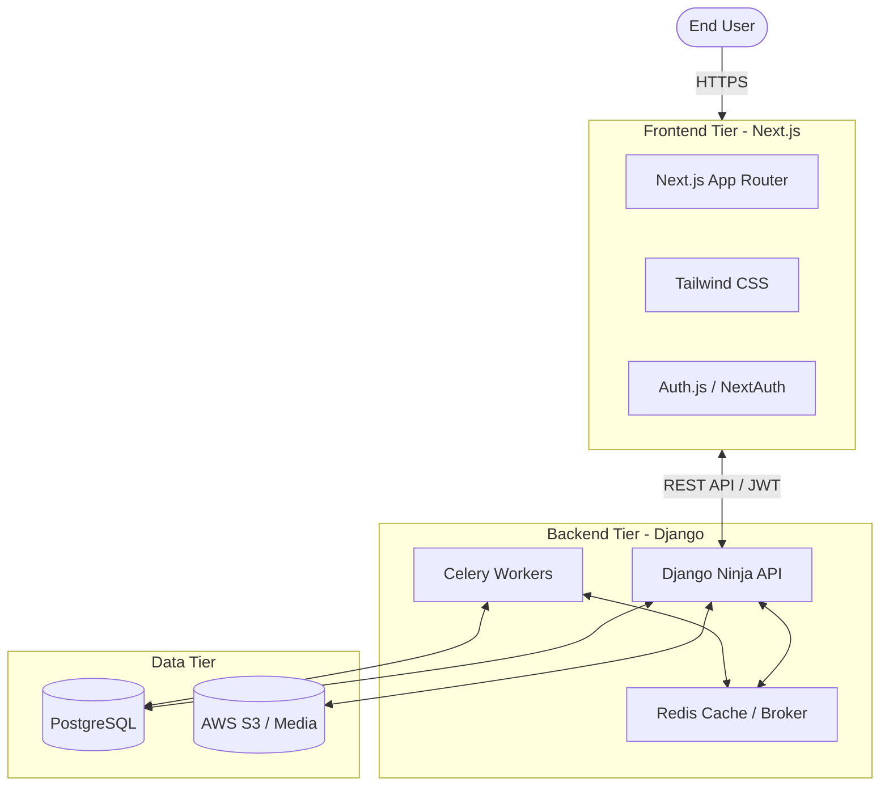

# OASIS Skills & Certification Portal 🎓


A state-of-the-art, full-stack e-learning and certification platform designed to provide a premium educational experience. The platform features dynamic course delivery, secure Google OAuth authentication, video processing, and real-time verifiable cryptographic certificates.

## 🌟 Key Features

* **Advanced Authentication:** Seamless login with Google OAuth or standard email/password, protected by an OTP-based email verification gate.
* **Premium User Experience:** Stunning UI built with Next.js 15, featuring a sleek dark mode, micro-animations, and dynamic glassmorphism components.
* **Course Enrollment & Delivery:** Comprehensive learning management system with categorizable courses, modular lessons, and integrated video playback.
* **Verifiable Certificates:** Cryptographically generated PDF certificates that can be instantly verified globally using a unique UUID scanner.
* **Intelligent Avatars:** Customizable user profiles with an interactive preset avatar picker and direct photo uploads.
* **Admin Dashboard:** Powerful Django Unfold admin panel with deep analytics and course management capabilities.

## 🏗️ System Architecture

The platform uses a decoupled architecture to ensure massive scalability and lightning-fast frontend delivery.



## 🚀 Getting Started (Local Development)

### Prerequisites
* Node.js (v18+)
* Python (3.11+)
* PostgreSQL

### 1. Backend Setup
```bash
cd backend
python -m venv venv
source venv/bin/activate  # On Windows: .\venv\Scripts\activate
pip install -r requirements.txt
python manage.py migrate
python manage.py runserver
```

### 2. Frontend Setup
```bash
cd frontend
npm install
npm run dev
```

## 🌍 Deployment Strategy
This massive project is designed to be deployed using a robust microservices approach:
1. **Frontend:** Deployed globally on [Netlify](https://netlify.com) for edge-caching and fast LCP.
2. **Backend:** Deployed on [Render](https://render.com) for persistent WSGI application scaling.
3. **Database:** Hosted on [Neon.tech](https://neon.tech) for serverless PostgreSQL.

---
*Built with ❤️ for the future of learning.*
